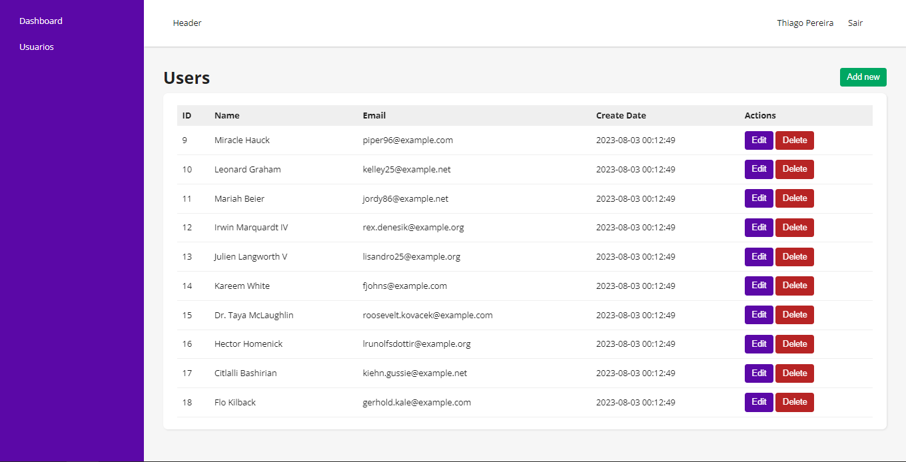

<h1 align="center"> Crud Laravel React </h1>

Projeto desenvolvido para aprendizado de laravel para api.  

  <a href="#-tecnologias">Tecnologias</a>&nbsp;&nbsp;&nbsp;|&nbsp;&nbsp;&nbsp;
  <a href="#-projeto">Projeto</a>&nbsp;&nbsp;&nbsp;|&nbsp;&nbsp;&nbsp;
  <a href="#-executando-o-projeto">Executando o projeto</a>&nbsp;&nbsp;&nbsp;|&nbsp;&nbsp;&nbsp;<a href="#-licença">Licença</a>

  

 

  

---

## 🚀 Tecnologias

Esse projeto foi desenvolvido com as seguintes tecnologias:

- ReactJS 
- Laravel
- SQLite

---

## 💻 Projeto

Com operações de CRUD, é possível criar, ler, atualizar e apagar registros de usuários, fazer login com as informações do usuário criado. Um sistema bem simples de cadastro, somente para aprendizado das tecnologias.

---

## 🔖 Executando o projeto

- Download do projeto `git clone https://github.com/pereirathiago/crud-react-laravel.git`.
- Copie `.env.example` para `.env`
- Entre na pasta `laravel` pelo terminal
- Execute `composer install`
- Defina a chave de criptografia `php artisan key:generate --ansi`
- Rode as migrations `php artisan migrate --seed`
- Iniciar o server `php artisan serve`
- Abra uma nova aba no terminal e acesse a pasta `react`
- Copie `.env.example` para `.env`
- Instale as dependencias com `npm i`
- Iniciar o server `npm run dev`
- Acesse `http://localhost:3000/` no seu navegador preferido

---

## 📝 Licença

Esse projeto está sob a licença MIT.

---

Feito com 💜 by Thiago Pereira 👋

